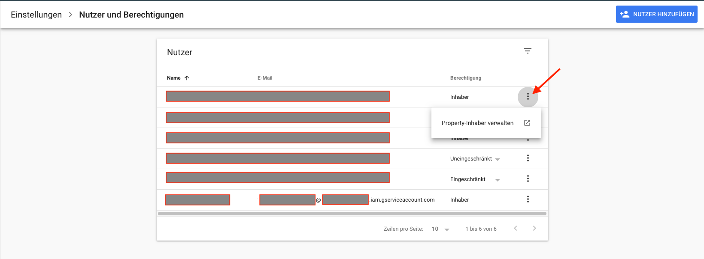

# TechDivision.Jobs.GoogleApi

> __This package is in beta status__  
> It does work from a technical point of view, but there might be a lot of edge cases with the google crawler.  
> We are happy if you can provide feedback from real world scenarios.
> Send them to neos@techdivision.com.  
> Thank you very much!

With Jobs you can access the google indexing API - currently the only valid use of the indexing API.  
Please be aware that this consumes your site's crawling budget, so use with care!

In order for this to work, we added
* a backend module to send your new/changed jobs to the api  
(one could make this automatic, but this is kinda dangerous because each little publish would send it to the API and eat up your crawling budget)
* a feature flag for automatic API calls on job deletion  
(which in turn is disabled by default for the same reason)

In addition, deleted jobs need to send at least a 404 header.  
If you are serious about jobs, please install [neos/redirecthandler-neosadapter](https://github.com/neos/redirecthandler-neosadapter) 
to send a proper 410 status code after job deletion. 

This package is based on [flowpack/googleapiclient](https://github.com/Flowpack/Flowpack.GoogleApiClient).  
Please follow the package instructions on how to setup your api key.

### Installation

TechDivision.Jobs.GoogleApi is available via packagist. Add `"techdivision/jobs-googleapi" : "1.0.*@dev"` to the require section of the composer.json
or run `composer require techdivision/jobs-googleapi:1.0.*@dev`.  

## The backend module


## Configuration
Enable the API call on deletion:

```
TechDivision:
  Jobs:
    GoogleApi:
      options:
        enableApiCallOnJobDeletion: false
        ...
```

After configuration there are a few things you need to do, if you haven't done them already:
[Prerequisites for the Indexing API](https://developers.google.com/search/apis/indexing-api/v3/prereqs#verify-site)  

####Important: After creating the project and a new service account you need to verify the site ownership!
Follow these steps to verify your service account as an **owner**.  

1. Follow the [recommended steps to verify ownership of your property.](https://support.google.com/webmasters/answer/9008080)  
2. After your property has been verified, open [Search Console](https://www.google.com/webmasters/tools/home).  
3. Click your verified property.
4. Click Settings.
5. Go to user settings.
6. Click manage property owner. (You need to be a Property-Owner!)

7. Add your service account mail.  
The email address has a format similar to the following:  
my-service-account@project-name.google.com.iam.gserviceaccount.com


## Logfiles
There is a logfile for more detailed information: `JobIndexingLog.log`

Enable logGoogleClientConfiguration if want to show your configuration after updating jobPostings.
```
TechDivision:
  Jobs:
    GoogleApi:
      options:
        ...
        logGoogleClientConfiguration: false
```

## Further packages
To make jobs complete, we do offer a set of packages:
* [techdivision/jobs](https://github.com/techdivision/jobs)  
Basic job package with schema.org markup
* [techdivision/jobs-applicationform](https://github.com/techdivision/jobs-applicationform)  
An application form based on [neos/form-builder](https://github.com/neos/formbuilder)
* [techdivision/card-jobs](https://github.com/techdivision/card-jobs)  
Visual card style for jobs (see also [techdivision/card](https://github.com/techdivision/card))
* [techdivision/form-encryption](https://github.com/techdivision/form-encryption)  
PGP/GPG form encryption to meet data protection standards 

### Contribution
We will be happy to receive pull requests - dont hesitate!
